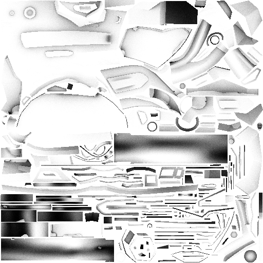
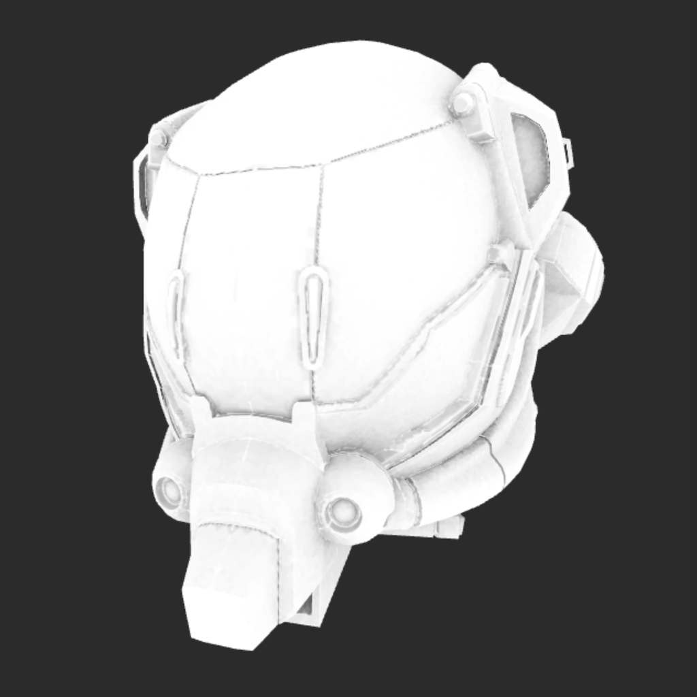

<h1 align="center">🌘 Albedo 🌒</h1>

Rust framework dedicated to real-time visualization.

  </img>

## Disclaimer
---

🚧 Albedo is a work-in-progress and might be unstable, use it at your own risks 🚧

## Goals
---

* Lightweight
* Easy to use
* Fast
* Oriented for real-time visualization
* As close as [wgpu](https://github.com/gfx-rs/wgpu) as possible for integration

Albedo **isn't** a game engine. It's designed to be a rendering framework made for real-time visualization. It's possible to
use as the rendering module for a game, but that's not the use case why it was designed.

## Features

### GPU Raytracing

  </img>

The [albedo_rtx](./crates/albedo_rtx) exposes GPU software Raytracing. You can use this crate to perform Ray-Triangle intersections.

* CWBVH from [tinybvh-rs](https://github.com/DavidPeicho/tinybvh-rs/)
* SVGF (Semi-working for now)

### Lightmapper

The library comes with the [albedo_lightmapper_native](./crates/albedo_lightmapper_native) crate used to generate lightmaps for a mesh.

For now, the lightmapper only generate an ambient occlusion map, but it will soon generate RGB lightmaps.

  </img>
  </img>

## Examples

### GPU Picking

While picking is doable using a rasterized G-Buffer of IDs, this example shows how it can be done using the raytracing crate.

https://github.com/albedo-engine/albedo/assets/8783766/9a4b07e5-d6c3-4be1-9535-15cd1e3235e1

