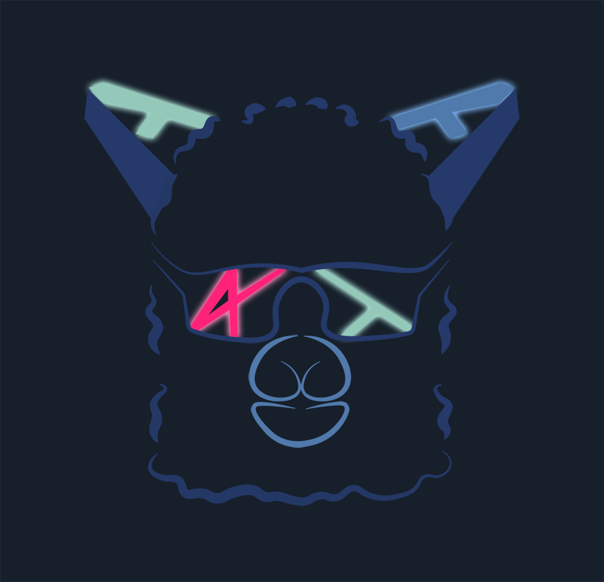

<h1 align="center">🌘 Albedo 🌒</h1>

Rust framework dedicated to real-time visualization.

  </img>

## Disclaimer
---

🚧 Albedo is a work-in-progress and might be unstable, use it at your own risks 🚧

## Goals
---

* Lightweight
* Easy to use
* Fast
* Oriented for real-time visualization

Albedo **isn't** and will **never** be a game engine. It's designed to be a
rendering framework made for real-time visualization. It's possible to
use as the rendering module for a game, but that's not the use case why it
was designed.

## Features

### GPU Raytracing

  </img>

The [albedo_rtx](./crates/albedo_rtx) exposes GPU software Raytracing. You can use this crate to perform Ray-Triangle intersections.

The [Albedo Pathtracer application](https://github.com/DavidPeicho/albedo) is one example of what you can achieve with the [albedo_rtx](./crates/albedo_rtx) crate:

### Lightmapper

The library comes with the [albedo_lightmapper_native](./crates/albedo_lightmapper_native) crate used to generate lightmaps for a mesh.

For now, the lightmapper only generate an ambient occlusion map, but it will soon generate RGB lightmaps.
